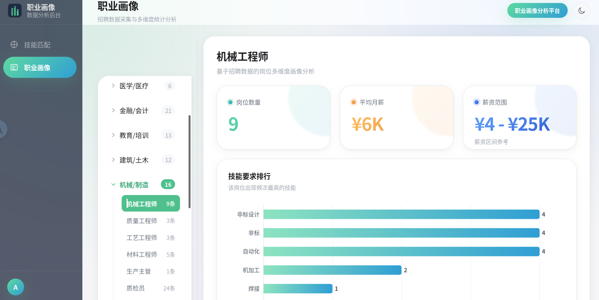

## 技术栈

| 层 | 技术 |
|---|---|
| 数据采集 | Scrapy |
| 数据处理 | Pandas / Jieba 分词 |
| 数据库 | MySQL 9.x |
| 后端 | FastAPI + PyJWT |
| 前端 | Vue 3 + Vite + ECharts + Pinia |
| 生产部署（可选） | Docker Compose + Nginx |

## 主页



## 环境要求

- **Python** 3.13+
- **Node.js** v22+
- **MySQL** 9.x（需提前安装并启动服务）
- 包管理器：后端 [uv](https://docs.astral.sh/uv/)，前端 [pnpm](https://pnpm.io/)
- 生产部署（可选）：[Docker](https://docs.docker.com/get-docker/) + Docker Compose

## 快速开始

### 1. 克隆项目

```bash
git clone <repo-url>
cd Vocational-Skill-Demand-Analysis-Platform
```

### 2. 一键导入数据库

`data/job_analysis.sql` 包含所有表结构和采集好的岗位数据，但**不含 `CREATE DATABASE` / `USE` 语句**，必须指定库名：

```bash
mysql -u root -p -e "CREATE DATABASE IF NOT EXISTS job_analysis;"
mysql -u root -p job_analysis < data/job_analysis.sql
```

> 导入后即拥有完整的 `job_analysis` 数据库（含 10 张表，包括 `user_profile`），无需手动建表或爬数据。
>
> ⚠️ **AI 职业顾问用到的 `user_ai_config` 表是后加的，不在这份 dump 里**。要使用 AI 顾问功能，导入 dump 之后补建这张表（不影响已导入的数据）：
> ```bash
> mysql -u root -p job_analysis -e "
> CREATE TABLE IF NOT EXISTS user_ai_config (
>   id INT AUTO_INCREMENT PRIMARY KEY,
>   user_id INT NOT NULL,
>   api_base_url VARCHAR(255) DEFAULT NULL,
>   api_key VARCHAR(255) DEFAULT NULL,
>   model VARCHAR(128) DEFAULT NULL,
>   updated_at DATETIME DEFAULT CURRENT_TIMESTAMP ON UPDATE CURRENT_TIMESTAMP,
>   UNIQUE KEY uk_ai_user (user_id),
>   FOREIGN KEY (user_id) REFERENCES users(id) ON DELETE CASCADE
> ) ENGINE=InnoDB DEFAULT CHARSET=utf8mb4;"
> ```
> 注意**不要**直接 `mysql ... < backend/schema.sql`：那个文件开头有 `USE job_analysis;`，会把语句执行到 `job_analysis` 库而不是你 `-D` 指定的库上。

### 3. 配置环境变量

复制模板并填入真实值（`.env` 已被 gitignore，不会提交）：

```bash
cp .env.example .env
# 编辑 .env，填入 DB_PASSWORD 等；生产前用 `openssl rand -hex 32` 生成强 SECRET_KEY
```

`.env` 示例：

```ini
DB_HOST=localhost
DB_PORT=3306
DB_USER=root
DB_PASSWORD=
DB_NAME=job_analysis

# development：本地调试，跳过下面的生产安全检查
# production（默认值，不写这行时的兜底）：SECRET_KEY 若缺失或仍是占位符，启动时直接拒绝运行
ENV=development

SECRET_KEY=dev-secret-key-change-in-production   # 生产前务必替换

# 允许跨域访问的前端源，逗号分隔；本地默认已含 Vite 开发端口，生产环境按需改成实际域名
CORS_ORIGINS=http://localhost:5173,http://127.0.0.1:5173
```

> 后端 `backend/config.py` 与爬虫 `spider/job_spider/pipelines.py` 均通过 `python-dotenv` 从**仓库根目录**的 `.env` 读取配置，仓库代码中无明文密码。

### 4. 安装后端依赖

在**仓库根目录**安装依赖（`load_dotenv()` 依赖 cwd 向上查找根目录 `.env`，不要进子目录运行）：

```bash
uv venv .venv
uv pip install -r backend/requirements.txt --python .venv/bin/python
```

> 若无 uv，可用 pip：

```bash
python -m venv venv
source venv/bin/activate          # Windows: venv\Scripts\activate
pip install -r backend/requirements.txt
```

> `backend/requirements.txt` 只含 API 服务自身的直接依赖；爬虫（Scrapy）单独在 `spider/requirements.txt`，只有跑爬虫时才需要装：`uv pip install -r spider/requirements.txt --python .venv/bin/python`。

### 5. 安装前端依赖

```bash
cd frontend
pnpm install
```

> 若无 pnpm，可用 `npm install`，但推荐 pnpm（仓库已提交 `pnpm-lock.yaml`）。

### 6. 启动项目

**终端1 — 启动后端（端口 8000）：**

```bash
# 必须在仓库根目录执行（import 路径为 backend.main）
.venv/bin/uvicorn backend.main:app --reload --port 8000
# 或：uv run uvicorn backend.main:app --reload --port 8000
```

**终端2 — 启动前端（端口 5173）：**

```bash
cd frontend
pnpm dev
```

浏览器打开 `http://localhost:5173`，首次访问需注册账号或用库中已有账号登录。

## 项目结构

```
├── backend/                     # FastAPI 后端
│   ├── main.py                  # 应用入口 + CORS（来源可配置，见 config.py）
│   ├── config.py                # 从 .env 读取 DB / JWT / CORS 配置，生产环境下校验 SECRET_KEY
│   ├── database.py              # SQLAlchemy 连接
│   ├── models.py                # ORM 模型（含用户个人求职画像 UserProfile）
│   ├── schemas.py                # Pydantic 请求/响应模型（含用户名/密码长度校验）
│   ├── auth.py                  # bcrypt 哈希 + JWT 签发/校验 + 鉴权依赖 get_current_username
│   ├── cleaner.py               # Pandas 数据清洗
│   ├── segmenter.py             # Jieba 分词 + 技能提取
│   ├── pipeline.py              # 完整数据处理流水线
│   ├── ai_tools.py              # AI 顾问的检索工具（每个函数都是一次真实聚合查询）
│   ├── routers/
│   │   ├── auth_router.py       # 注册 / 登录
│   │   ├── profile_router.py    # 职业画像查询 / 技能匹配（全部需要登录）
│   │   ├── account_router.py    # 个人求职画像 + AI 接口配置（全部需要登录）
│   │   └── advisor_router.py    # AI 职业顾问问答，OpenAI 兼容接口 + 工具调用
│   ├── schema.sql               # 参考建表语句（真实数据以 data/job_analysis.sql 为准）
│   ├── requirements.txt         # 后端服务自身的直接依赖
│   └── Dockerfile               # 生产镜像构建
├── frontend/                     # Vue 3 前端
│   ├── src/
│   │   ├── views/                # 页面
│   │   │   ├── LoginView.vue          # 登录 / 注册
│   │   │   ├── JobProfileView.vue     # 职业画像仪表盘（行业-职位手风琴树，可拖拽调宽）
│   │   │   ├── MatchView.vue          # 技能匹配（自动带出已保存的个人技能，可再编辑）
│   │   │   ├── AdvisorView.vue        # AI 职业顾问对话页
│   │   │   └── AccountView.vue        # 个人中心：求职画像 + AI 接口配置 + 退出登录
│   │   ├── components/
│   │   │   ├── common/           # BrandLogo / EmptyState / Loading / ThemeToggle
│   │   │   └── dashboard/        # StatCard / ChartCard / Sidebar（可拖拽调宽）
│   │   ├── styles/                # 设计 token（variables.css，含浅色/深色两套）+ 全局样式
│   │   ├── api/index.js          # Axios 封装（baseURL 走 VITE_API_BASE_URL）
│   │   ├── stores/                # Pinia：auth.js 认证状态 / theme.js 深浅主题
│   │   └── router/index.js       # 路由 + 登录守卫
│   ├── index.html                 # 含深浅主题的无闪烁初始化脚本
│   ├── nginx.conf                 # 生产环境 Nginx 配置（静态资源 + /api 反代）
│   ├── Dockerfile                 # 生产镜像构建（多阶段：pnpm build → Nginx）
│   └── .env.example                # 前端环境变量模板（VITE_API_BASE_URL）
├── spider/                       # Scrapy 爬虫（读根目录 .env 连库）
│   ├── job_spider/spiders/boss_spider.py
│   └── requirements.txt          # 爬虫自身的直接依赖，只有跑爬虫时需要
├── data/
│   └── job_analysis.sql     # 完整数据库导出
├── docker-compose.yml             # 生产部署编排（mysql + backend + frontend）
├── .dockerignore
└── .env.example                   # 后端/爬虫共用的环境变量模板
```

## API 概览

路由前缀：认证 `/api/auth`，职业画像 `/api/profile`，个人账户 `/api/account`，AI 顾问 `/api/advisor`。除 `/api/auth/*` 外全部需要 `Authorization: Bearer <token>`。

| 方法 | 路径 | 说明 |
|---|---|---|
| POST | `/api/auth/register` | 注册，返回 JWT |
| POST | `/api/auth/login` | 登录，返回 JWT |
| GET | `/api/profile/jobs/tree` | 行业-职位树 |
| GET | `/api/profile/jobs/{title}` | 单岗位画像（统计 + 图表数据） |
| GET | `/api/profile/skills/rank` | 技能重要度排行 |
| GET | `/api/profile/skills/salary` | 技能-薪资关系 |
| GET | `/api/profile/cities` | 城市需求量 |
| GET | `/api/profile/education` | 学历分布 |
| POST | `/api/profile/skills/match` | 技能匹配岗位 |
| GET | `/api/account/me` | 获取当前用户的个人求职画像（未保存过则返回空字段，不是 404） |
| PUT | `/api/account/profile` | 保存/更新个人求职画像（期望职位、城市、学历、经验、期望薪资、技能） |
| GET/PUT/DELETE | `/api/account/ai-config` | 用户自己的 OpenAI 兼容接口配置（API Key 只写不读，不会返回前端） |
| POST | `/api/account/ai-config/models` | 从接口的 `/models` 端点拉取可用模型列表 |
| POST | `/api/account/ai-config/test` | 测试连接：真实发一次带工具定义的最小请求，验证地址/Key/模型/工具调用是否都可用 |
| GET | `/api/advisor/status` | 当前用户是否已配置可用的 AI 模型 |
| POST | `/api/advisor/chat` | AI 职业顾问问答（基于真实数据的工具调用） |

前端 `axios` baseURL 由 `VITE_API_BASE_URL` 决定（本地 `pnpm dev` 默认回退到 `http://localhost:8000/api`），请求拦截器自动加 `Authorization: Bearer <token>`；登录守卫对 `requiresAuth` 路由检查 localStorage token（这只是前端跳转体验，真正的访问控制是后端对 `/api/profile/*`、`/api/account/*` 的 JWT 校验）。

## 功能概览

1. **账号系统** — 注册 / 登录（bcrypt 哈希 + JWT 认证，后端对受保护接口强制校验）
2. **职业画像** — 行业→职位手风琴式展开选择（左侧面板宽度可拖拽调整），查看岗位数量、平均薪资、薪资范围，技能排行 / 城市分布 / 学历要求 / 招聘公司（ECharts 可视化，统一 StatCard / ChartCard 组件）
3. **技能匹配** — 输入已有技能，匹配最适合的岗位，分析已匹配/需补充技能；若已在「个人中心」保存过求职画像，进入页面会自动带出已保存的技能（仍可编辑）
4. **个人中心** — 手动填写求职画像（期望职位、城市、学历、经验、期望薪资范围、技能列表），退出登录入口也在这里（侧边栏底部只留头像，点击跳转）
5. **AI 职业顾问** — 基于平台真实招聘数据的智能问答，可以问岗位、技能、薪资、行业趋势和学习建议。回答里凡是涉及数字的结论，都由模型先调用后端查询工具（岗位画像 / 技能排行 / 技能薪资 / 城市分布等）拿到真实聚合数据后再作答，答案下方会标注本次查询了哪些数据，尽量避免脱离数据臆造。**使用你自己的模型服务**：任何 OpenAI 兼容接口都可以（DeepSeek、通义千问、Moonshot，或自建 vLLM / Ollama 网关），在「个人中心」填写 API 地址和 API Key 后，可以点「获取模型」直接从接口的 `/models` 端点拉取模型列表点选（也可以手动输入模型名），再点「测试连接」验证是否可用——测试会真实发一次带工具定义的最小请求，因此能区分「连不上/Key 错误」和「能连上但该模型不支持 function calling」（AI 顾问依赖工具调用查真实数据，后者同样用不了）。项目本身不绑定任何厂商、不内置任何 Key。
6. **界面** — 侧边栏宽度可拖拽调整（160–360px，记住上次设置）；支持浅色/深色主题切换（顶栏右上角按钮，记住选择，也会跟随系统偏好）

## 数据处理管道

```bash
# 在仓库根目录执行
python -m backend.pipeline                            # raw_jobs → 清洗 → 分词
python -m backend.pipeline --reset                    # 先清空再处理
python -m backend.pipeline --import-file data.xlsx    # Excel/CSV 直接导入后分词
```

导入文件需含列：`title, city, education, experience, requirements, company, source, salary_min, salary_max, salary_avg`。

## 爬虫

```bash
cd spider && scrapy crawl boss
```

> 爬虫 `pipelines.py` 现已从根目录 `.env` 读取 DB 配置，与后端一致。

## 生产部署（Docker Compose）

三个容器：`mysql`（数据卷持久化） + `backend`（uvicorn 多 worker，仅内部网络可达） + `frontend`（Nginx 托管构建产物 + 反代 `/api` 到 backend，唯一对外暴露 80 端口的服务）。

```bash
# 1. 在服务器上准备生产用 .env（不要复用本地开发的 .env）
cp .env.example .env
# 编辑 .env：
#   DB_PASSWORD=<强密码>
#   SECRET_KEY=<openssl rand -hex 32 生成>
#   CORS_ORIGINS=https://your-domain.com   # 换成实际域名，多个用逗号分隔
#   ENV 可以不写——compose 会强制注入 ENV=production

# 2. 构建并启动
docker compose up -d --build

# 3. 确认健康
curl http://<服务器IP>/api/health
```

**关键点**：
- `data/job_analysis.sql` 通过 `docker-entrypoint-initdb.d` 挂载，**只在 `mysql_data` 数据卷首次为空时执行一次**；之后重启/更新不会重新导入，也不会覆盖数据。dump 已包含 `user_profile` 表，无需额外建表。
- 前端的 API 地址在**构建时**烘焙进 JS 包（`VITE_API_BASE_URL`，`docker-compose.yml` 里传的是 `/api`），改了这个值必须 `docker compose up -d --build frontend` 重新构建，而不是重启容器就行。
- `backend` 没有发布端口到宿主机，只有 `frontend`（Nginx）对外监听 80——外部无法绕过反代直接打后端。
- **HTTPS 没有包含在这套 compose 里**——上面这套只监听 80。有了真实域名并解析到服务器后，推荐在宿主机上装 [Certbot](https://certbot.eff.org/) 的 Nginx 插件为宿主机自己的 Nginx 签发证书做 TLS 终止再反代到这个 compose 暴露的 80 端口；或者把证书挂载进 `frontend` 容器、在 `nginx.conf` 里加 `listen 443 ssl`。域名和证书策略因人而异，这里不代为决定。
- 更新代码后重新部署：`git pull && docker compose up -d --build`。
- 看日志：`docker compose logs -f backend`（或 `frontend` / `mysql`）。

> 这套配置未经 `docker compose up` 实机跑通验证，只做过 YAML 语法校验和文件路径核对——首次在你的服务器上跑建议盯着 `docker compose up --build`（不加 `-d`）的输出，确认三个服务都启动成功再切到后台模式。
